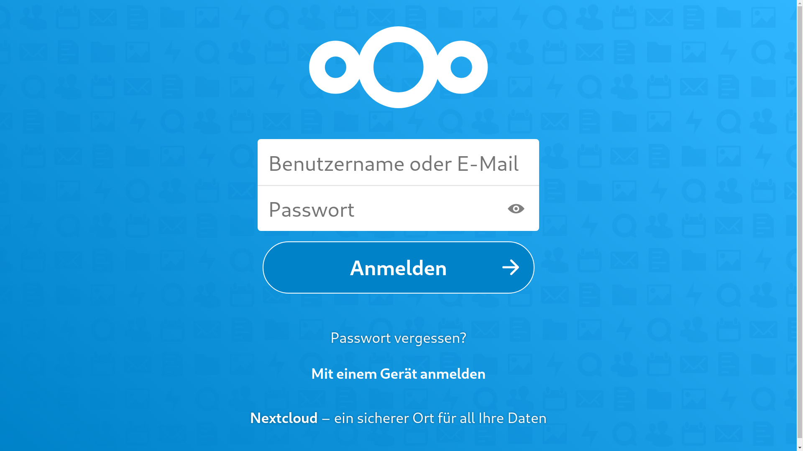

# Docker Nextcloud MariaDB

[_logo.svg.png "Docker Logo")](https://en.wikipedia.org/wiki/Docker_(software)#/media/File:Docker_(container_engine)_logo.svg)

## Dokumentation für die bewertete Hausübung 2

Gruppe 6: Clemens Horn, Niklas Schimmack, Julian Freundt

## Voraussetzungen

Unix-artiges Betriebssystem auf dem Docker installiert ist sowie ggf. Administrationsrechte.

Auf Windows sollte Docker Desktop sowie ein Unix-Terminal-Emulator wie z.B. Git Bash installiert sein.

Die Ports 80, 443 und 3306 müssen frei sein.

## Benutzung

Um dieses Projekt zu benutzen, muss das Projekt geklont und das Start Skript ausgeführt werden. Auf Unix müssen die Shellskripte Ausführungsrechte erhalten. Auf Windows sollten die Befehle zum Ausführen des Projekts per Git Bash erfolgen.

Alternativ können die Dockerfiles auch manuell verwendet werden.

### Windows

```bash

git clone https://github.com/clemenshorn/docker-gcc.git

cd docker-gcc

scripts/start.sh

```

### Unix

```bash

git clone https://github.com/clemenshorn/docker-gcc.git

cd docker-gcc

chmod -R +x scripts/ 

scripts/start.sh

```

## Erläuterung MariaDB

Es war gefordert eine Nextcloud in einem Dockercontainer unter den Ports 80 und 443 bereitzustellen und eine Datenbank anzuschließen. Bei der Datenbank fiel die Wahl auf MariaDB/MySQL.

Damit Nextcloud an eine Datenbank angeschlossen werden kann, muss diese vorher existieren, daher wird zunächst die Datenbank mittels Dockerfile definiert.

```Dockerfile
FROM mariadb

VOLUME /var/lib/docker/volumes/db

EXPOSE 3306
```

`FROM` bestimmt, dass das offizielle MariaDB-Image als Grundlage für den Datenbankcontainer dienen soll und `VOLUME` bestimmt `db` als Ordner für die Persistierung von Daten als Volumen in dem Standardverzeichnis, in dem Docker auf Unixsystemen Volumen speichert. Die Anwendung wird mittels `EXPOSE` auf dem Port 3306 innerhalb des Containers bereitgestellt.  

Um aus diesem Dockerfile ein Image herzustellen, das in einem Dockercontainer ausgeführt werden kann, muss der `docker build` Befehl verwendet werden.

```bash
docker build -t mariadb:gcc -f docker/mariadb.Dockerfile  .
```

Der `-t` Schalter bewirkt, dass das Image einen Tag bzw. Namen erhält, auf den man sich später beziehen kann und der `-f` Schalter bestimmt welcher Dockerfile verwendet werden soll. Der `.` am Ende des Befehls sagt aus von welchem Verzeichnis ausgehend Docker nach den Dockerfiles suchen soll. In diesem Projekt wird stets davon ausgegangen, dass die Befehle von der Wurzel des Projekts ausgeführt werden.

Als nächstes wird mittels des `docker run` Befehls das Image in einem Container ausgeführt.

```bash
docker run -d \
    --env-file env/mariadb.env \
    -p 3306:3306 \
    -v /var/lib/docker/volumes/db:/var/lib/mysql \
    --name mariadb \
    mariadb:gcc
```

Der `-d` Schalter bewirkt, dass der Container im Hintergrund ausgeführt wird und nicht in der Terminalsitzung, in der der Befehl ausgeführt wird. Der `--env-file` Schalter erlaubt die Angabe einer Datei, die die benötigten Umgebungsvariablen enthält, um eine MySQL-Datenbank zu initialisieren und `-p` bestimmt zunächst welcher Port des Hostbetriebssystems auf welchen Port des Containers gelegt werden soll, sodass eine Kommunikation zwischen Host und Container möglich wird. Der Schalter `-v` bestimmt nun welcher Ordner auf dem Hostsystem als Volumen genutzt werden soll und in welchem Ordner des Containers die Dateien abgelegt werden. Hierbei wurden die Standardpfade verwendet. Der Schalter `--name` bestimmt welchen Name der Container erhalten soll und als letztes wird bestimmt welches Image verwendet werden soll, dies wurde zuvor s.o. festgelegt.

## Erläuterung Nextcloud

Mit der nun containerisierten Datenbank kann die Nextcloud mittels Dockerfile definiert werden.

```Dockerfile
FROM nextcloud

VOLUME /var/lib/docker/volumes/nextcloud

EXPOSE 80 443
```

Da die Nextcloud auf den Ports 80 und 443 zugänglich sein soll, wird dies entsprechend im Dockerfile definiert. Es wird das offizielle Nextcloud-Image verwendet, das die Grundlage für den Container bildet.

Das Nextcloud-Image kann nun hergestellt werden.

```bash
docker build -t nextcloud:gcc -f docker/nextcloud.Dockerfile .
```

Nun kann das Image in einem Container ausgeführt werden und mit der Datenbank verknüpft werden.

```bash
docker run -d \
    --env-file env/mariadb.env \
    --env-file env/nextcloud.env \
    --name nextcloud \
    -p 80:80 \
    -p 443:443 \
    -v /var/lib/docker/volumes/nextcloud:/var/www/html \
    --link mariadb:gcc \
    nextcloud:gcc
```

Um die Datenbank an die Nextcloud anzuschließen muss der `--link` Schalter verwendet werden sowie die Umgebungsvariablen für die Datenbank mittels `--env-file` angegeben werden. Um auf die Nextcloudanwendung auf mehreren Ports zugreifen zu können, muss der `-p` Schalter mehrmals entsprechend angegeben werden. Nach Ausführung dieses Befehls kann auf die Nextcloud dann im Browser unter `localhost:80` und `localhost:443` zugegriffen werden.
Die Administrationsanmeldedaten können in der Datei `env/nextcloud.env` entsprechend angepasst werden.

Das Skript `scripts/start.sh` führt alle erläuterten Befehle aus und stellt die Nextcloud bereit.



## Quellen

1. <https://hub.docker.com/_/mariadb>
2. <https://hub.docker.com/_/nextcloud>
3. <https://docs.docker.com/get-started07_multi_container/>
4. <https://docs.docker.com/get-started/05_persisting_data/>
5. <https://docs.docker.com/engine/reference/commandline/build/>
6. <https://docs.docker.com/engine/reference/commandline/run/>
7. <https://en.wikipedia.org/wiki/Docker_(software)#/media/File:Docker_(container_engine)_logo.svg>
